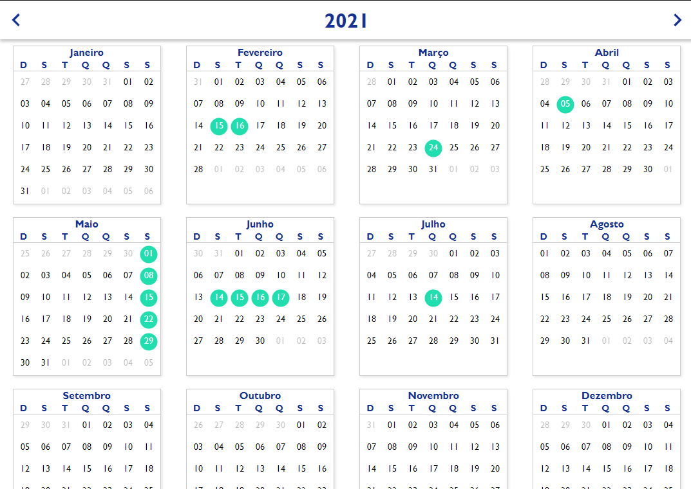

# React-JS--Full-Calendar

  

## Youtube

## Installation

  1. `$ npm install` or `$ yarn`
  2. `$ npm start` or `$ yarn start`

## Functionalities

  + Click to mark the date to an array of selected dates and apply a different css.
  + Click to unmark the date to an array of selected dates and apply a different css.
  + Change the years.
  
## Used Libraries

 + `sass`
 + `moment`
 + `styled-components`
 + `@mui/material`
 + `@mui/icons-material`
